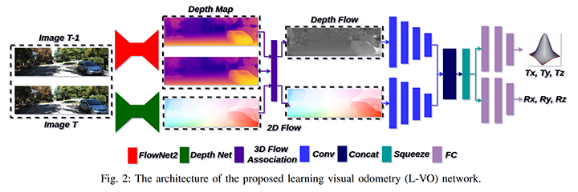
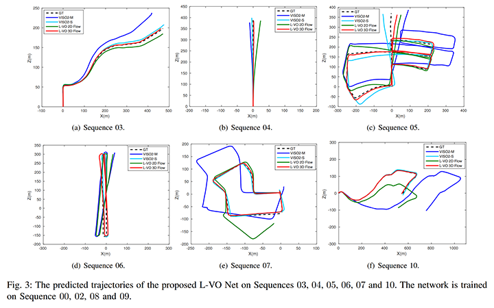
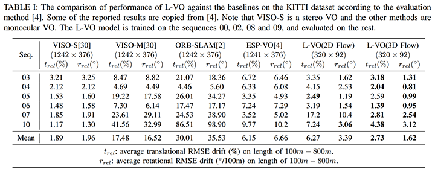
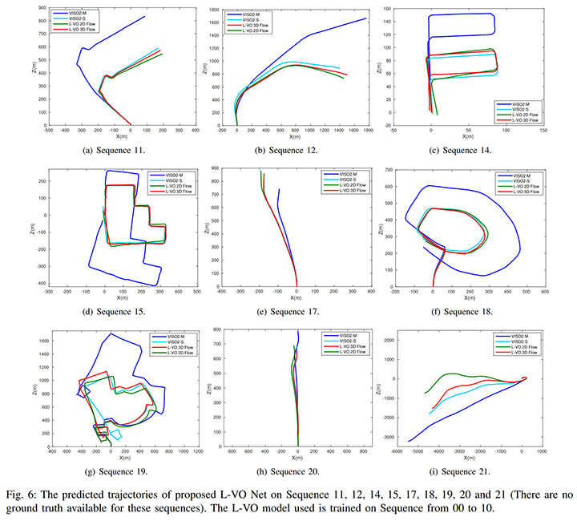
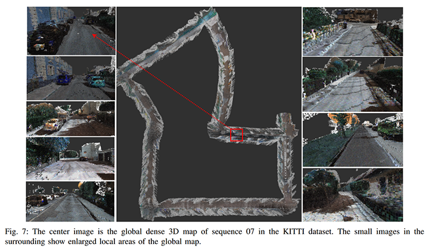

# Learning monocular visual odometry with dense 3D mapping from dense 3D flow [arxiv](https://arxiv.org/abs/1803.02286)

- 著者
    - Cheng Zhao *1
    - Li Sun *2
    - Pulak Purkait *3
    - Tom Duckett *2
    - Rustam Stolkin *1
- 所属
    - 1: Extreme Robotics Lab, University of Birmingham, Birmingham, UK, B15 2TT
    - 2: Lincoln Centre for Autonomous Systems (L-CAS), University of Lincoln, UK, LN6 7TS
    - 3: Cambridge Research Lab, Toshiba Research Europe, Cambridge, UK, CB4 0GZ

## どんなもの？
- 全てを深層学習で記述した単眼カメラのための Visual SLAM

## 先行研究と比べてどこがすごい？
- 単眼カメラの Visual SLAM を全て深層学習で記述したこと
- KITTI odometry benchmark で平均並進誤差 2.68%、平均回転誤差 0.00143°/m を達成したこと

## 技術や手法の肝は？
- Flownet 2.0: 時刻 t の画像から時刻 t+1 の画像への変化をとらえた２次元オプティカルフローを求める DNN
- Depth Net: 時刻 t と時刻 t+1 の画像から深度マップを求める DNN
- 3D flow association layer: ２次元オプティカルフローと２つの深度マップから３次元オプティカルフローを求める DNN（訓練するパラメータがない単純な計算）
- L-VO network: ３次元オプティカルフローを畳み込んで、６次元の姿勢ベクトル（並進・回転）を推定する DNN
- Bivariate Gaussian loss functio: L-VO network で使われる損失関数（Bivariate Gaussian 分布に基づく）

## どうやって有効だと検証した？
- データセット: KITTI VO/SLAM benchmark を使った。このデータセットには 22 トリップのデータがあり、最初の 11 個はセンサデータと教師データが含まれ、残りはセンサデータのみが含まれる。
- 訓練・検証: 320×96に縮小した画像を用いた。00, 02, 08, 09 を訓練に使い、03, 04, 05, 06, 07, 10 を検証に用いた。

- 自己位置推定の性能評価: 次の手法の性能を KITTI VO/SLAM evaluation metrics を用いて比較した。単眼カメラの手法の中では最も良かった。教師がないトリップについては軌道を可視化した。
    - VISO-S: ステレオカメラ
    - VISO-M: 単眼カメラ
    - ORB-SLAM:　単眼カメラ
    - ESP-VO: 単眼カメラ
    - L-VO (2D Flow): 単眼カメラ, 完全深層学習（提案手法）
    - L-VO (3D Flow): 単眼カメラ, 完全深層学習（提案手法）
- 密な三次元マッピング: 次の手法を用いて３次元地図を生成（オンライン）して比較した。地図表現には OctoMap を用いた。生成した地図を分かりやすくするために、たくさんの外れ値やノイズを除去した。
    - LSD-SLAM: 単眼カメラ
    - ORB-SLAM: 単眼カメラ
    - L-VO (3D Flow): 単眼カメラ, 完全深層学習（提案手法）

## 議論はある？
- 深層学習を使った SLAM は大きな計算資源が必要となる点が批判されるが、5G の高速通信を利用した service-client mode を使うことで緩和されると信じている。

## 次に読むべきタイトルは？

### Depth Net
- [arxiv](https://arxiv.org/abs/1609.03677) C. Godard, O. Mac Aodha, and G. J. Brostow, "Unsupervised monocular depth estimation with left-right consistency", CVPR, 2017.

### Depth Net の訓練済みモデルとして使ったもの
- [arxiv](https://arxiv.org/abs/1612.02401) B. Ummenhofer, H. Zhou, J. Uhrig, N. Mayer, E. Ilg, A. Dosovitskiy, and T. Brox, "Demon: Depth and motion network for learning monocular stereo", CVPR, 2017

### Flownet 2.0
- [arxiv](https://arxiv.org/abs/1612.01925) E. Ilg, N. Mayer, T. Saikia, M. Keuper, A. Dosovitskiy, and T. Brox, "Flownet 2.0: Evolution of optical flow estimation with deep networks", CVPR, 2017.
.