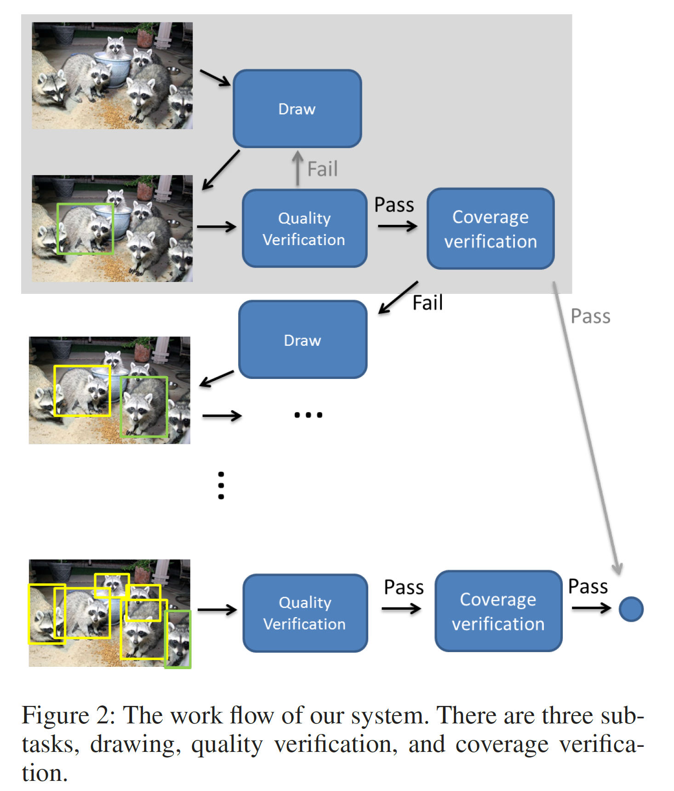
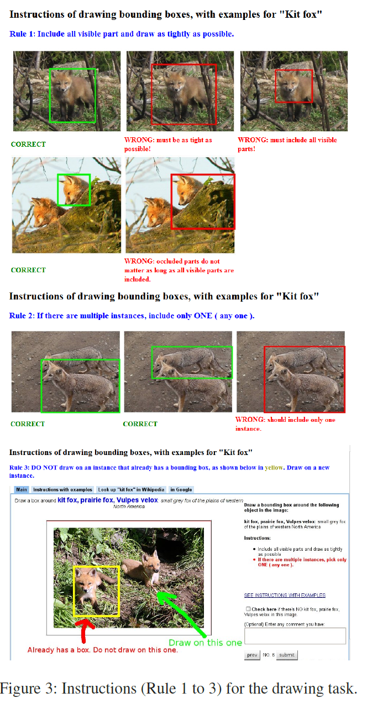
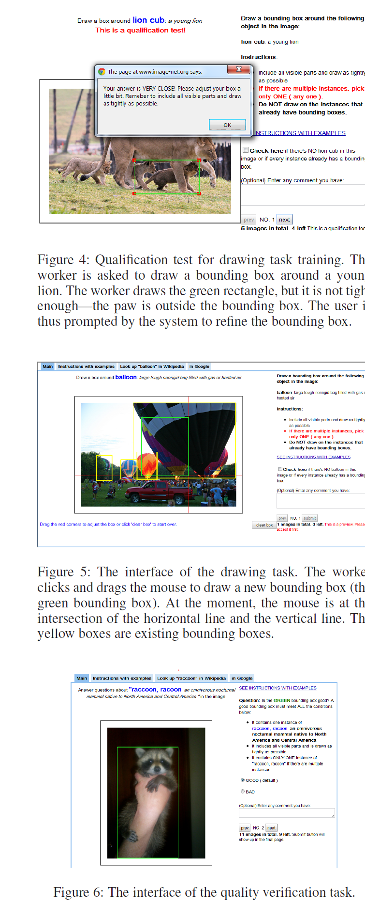
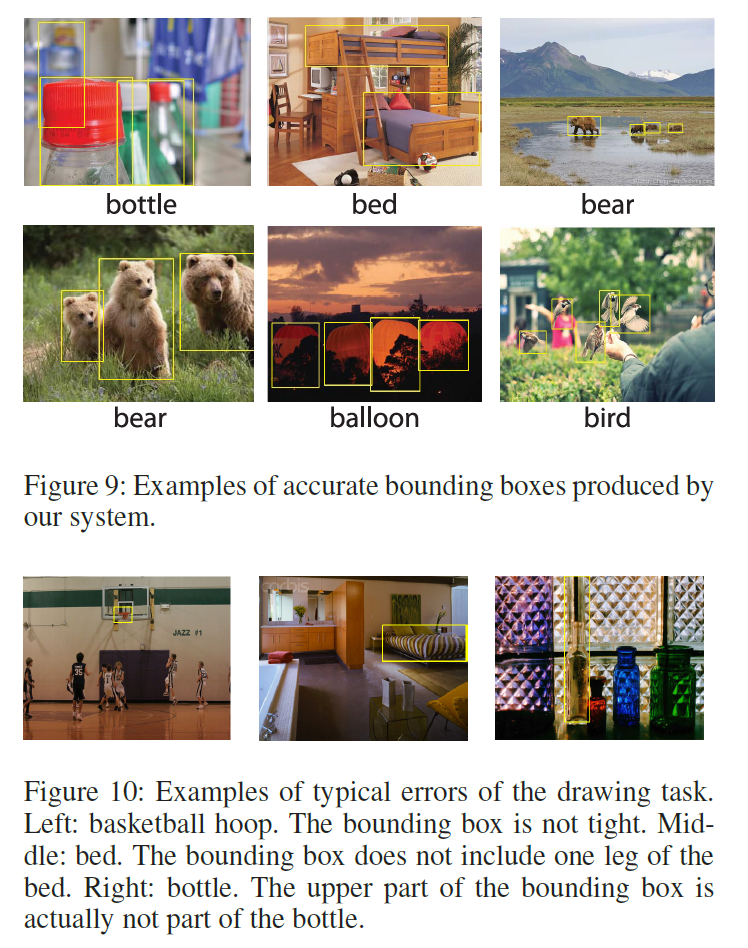
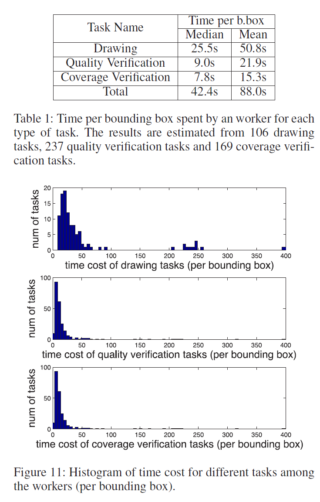

Crowdsourcing Annotations for Visual Object Detection
===

January 2012,  Hao Su, Jia Deng, Li Fei-Fei

https://www.researchgate.net/publication/291249011_Crowdsourcing_annotations_for_visual_object_detection
https://www.aaai.org/ocs/index.php/WS/AAAIW12/paper/viewFile/5350/5599

（まとめ：@yuji38kwmt）

---

## どんなもの？

* クラウドソーシングでbounding boxアノテーションを収集するシステムの紹介
* ワークフローは以下の3つのsub-taskで成り立っている。
    * Drawing: 1人目の作業者がbounding boxで対象物を囲う
    * Quality verification: 2人目の作業者が、bounding boxで対象物を正しく囲われていることを確認する
    * Coverage verification: 3人目の作業者が、すべての対象物がbounding boxで囲われていることを確認する

---
## 先行研究と比べて何がすごい？
* 品質管理を多数決で行わないことにより、「小さなコストで高い品質」を実現できる
    * 画像にObjectや属性が存在するかどうかのアノテーションならば、多数決での品質管理でうまくいく。
    * bounding boxで囲う作業は時間がかかるので、多数決に向かない
    * 2種類のverificationは、多肢選択問題なので多数決で品質管理できる
* クラウドソーシングでbounding boxを集める詳細な研究がない時代（2012年時点）に、この論文を出した

---

## 技術や手法の肝は？

* ワークフローが以下の原則に従っている
    * 可能な限りシンプルにする（1個のbounding box単位でアノテーションできる）
    * 作業量の予測ができる（bounding box単位で作業量を見積もれる？）
* drawing taskに対してトレーニングを義務付けている
    * 間違ったbounding boxに対して、作業者はフィードバックを受ける
    * テスト用の画像で実施.トレーニングが完了したら本物の画像で作業する。
* quality verification task, coverage verification taskに対してもトレーニングを義務付けている

---

## どうやって有効だと検証した？

* Amazon Mechanical Turkにデプロイして品質とコストを評価した
    * 使った画像はImageNetの10カテゴリ（ balloon,bear, bed, bench, beach, bird, bookshelf, basketball, hoop, bottle, and people）
    * カテゴリごとに200枚。

### 全体の品質
* 97.9% Boundinx Boxが付与されていた
    * Bounding Boxのミス：the size is too small, the boundary is blurry, or there is strong shadow
* Boundinx Boxの精度は99.2%

### コスト
* drawing taskの作業時間はverification taskの2倍以上
* 多数決よりも効率的（どんな多数決でも、最低drawing taskのコストの2倍かかる）
    * 多数決だと時間の平均値で32.8%コスト増、中央値だと38.9%コスト増

### sub-taskごとの品質
* drawing taskの品質は62.2%(6861個のbounding boxの内、4267個受け入れされた)
* quality verification taskの品質は89.9%(AMTに投げた629個のタスクの内566タスク)
    * 多数決で決める(good bounding boxは3人が異議を唱えない場合)
    * よくある間違いの原因はspammersによるもの（all goood or all bad）
* coverage verification taskの品質は95.0%（AMTに投げた427タスクの内406タスク）
* drawing taskはverification taskより時間がかかるだけでなく難しい
* 作業者のトレーニングによって、トレーニングしないときより4.2% quality verificationが増加した
    * トレーニングなし: 58.0%
    * トレーニングあり: 62.2%

---

## 議論はある？
* なし

---

## 次に読むべき論文は？

* [Crowdsourcing image analysis for plant phenomics to generate ground truth data for machine learning](https://www.researchgate.net/publication/326702734_Crowdsourcing_image_analysis_for_plant_phenomics_to_generate_ground_truth_data_for_machine_learning)
* [Leveraging Pre-Trained 3D Object DetectionModels For Fast Ground Truth Generation](https://www.researchgate.net/publication/326459092_Leveraging_Pre-Trained_3D_Object_DetectionModels_For_Fast_Ground_Truth_Generation)
* [Faster Bounding Box Annotation for Object Detection in Indoor Scenes](https://www.researchgate.net/publication/326290689_Faster_Bounding_Box_Annotation_for_Object_Detection_in_Indoor_Scenes)
* [Collaborative Annotation of Semantic Objects in Images with Multi-granularity Supervisions](https://www.researchgate.net/publication/328372381_Collaborative_Annotation_of_Semantic_Objects_in_Images_with_Multi-granularity_Supervisions)

-------
# @yuji38kwmtのメモ

### 所感
* Boundinx Boxのルールが分かりやすい。アノテーションルールを作成するときの参考になる。
* 著者に有名な研究者[Li Fei-Fei](https://en.wikipedia.org/wiki/Fei-Fei_Li)も含まれている
* badなbounding boxの例では、一目でbadだと分かる画像だった。数px単位で、ズレているズレていないを判断している訳ではなさそう。
* "quality verification task"の品質を測るのに多数決を採用しているが、ImageNetの正解情報を使えば多数決は不要にならない？
* [61個の論文から引用されている](https://www.researchgate.net/publication/291249011_Crowdsourcing_annotations_for_visual_object_detection)。
* 今後作業時間を評価する際は、平均値だけでなく中央値も意識しよう

### 調べた英語
* Meanwhile: 話は変わって
* emergence : 出現
* leverage: 影響力
* sub-optimal : 
* Active learning ?
* indispensable : 絶対必要な
* solicit : せがむ
* assure : 保証する
* intuitive : 直観的
* mandate : 権限を与える。指示する, 義務付ける
* refine: 洗練する
* adopt: 採択する
* perturb : かきみだす。狼狽させる
* blurry: 不鮮明な
* somewhat : いくぶんか
* out of : ～の中から
* fundamental : 基本的な
* Indeed : 実際に
* rely : 信頼する
* substantially: 実質、大体
* facilitate : 簡単にする
* coverage: 範囲
* worth: 価値がある
* precise: 正確な
* to this end: ～に向けて
* implications: 意味合い、含み、
* objection: 異議

### その他
* TurKontrol: 修正と評価の逐次実行
* https://speakerdeck.com/yukinobaba/human-computation-and-crowdsourcing を読もう
