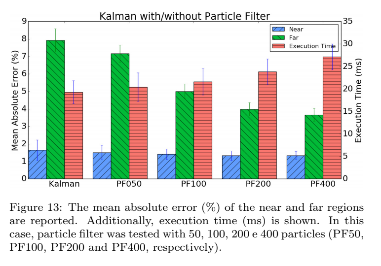
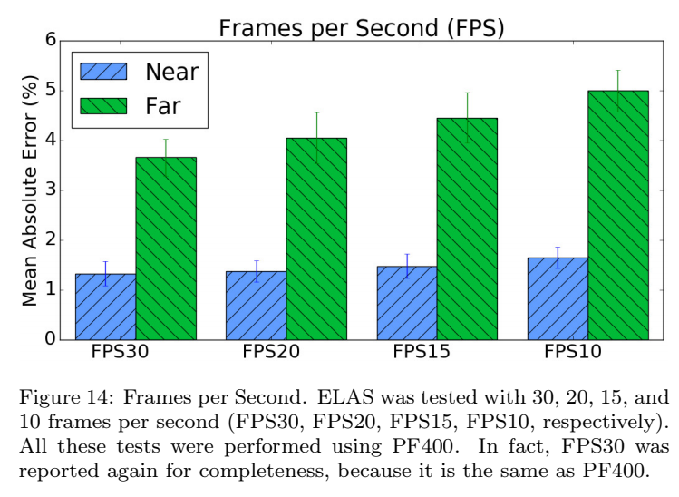
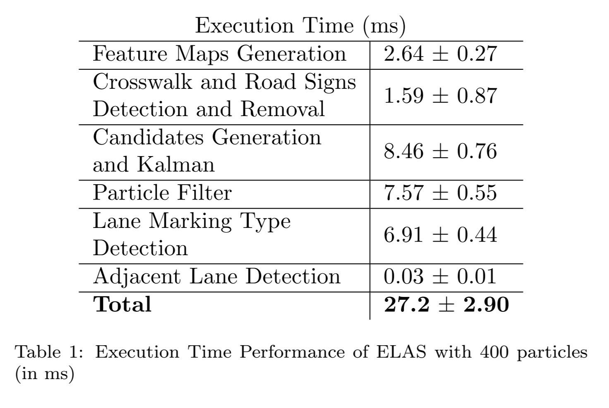
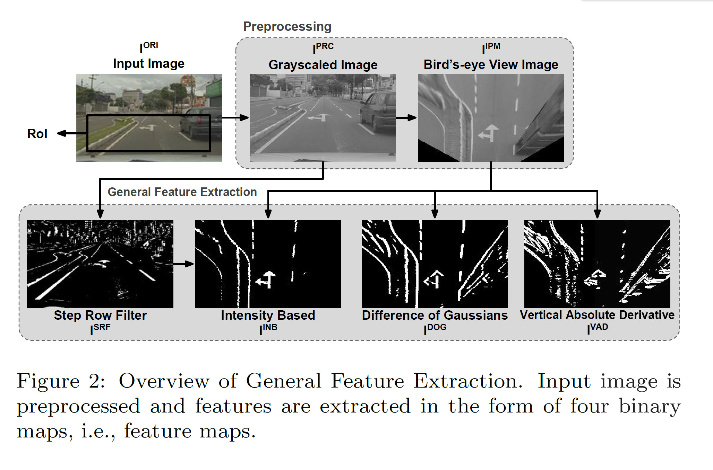
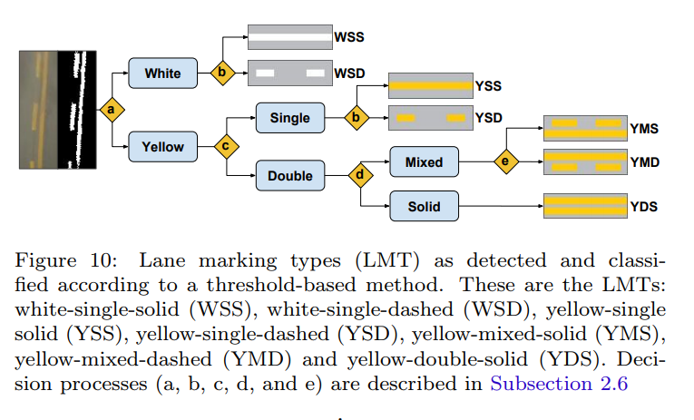

Ego-Lane Analysis System (ELAS): Dataset and Algorithms
===

2018/01/15 Rodrigo F. Berriel, Edilson de Aguiar, Alberto F. de Souza, Thiago Oliveira-Santos

https://arxiv.org/abs/1806.05984

（まとめ：@yuji38kwmt）

---

## どんなもの？

* リアルタイムの自車レーン解析システム real-time visionbased Ego-Lane Analysis System (ELAS)
    * 自車レーンの位置
    * LMT(lane marking type)の分類
    * Road marking
    * LDW
    * レーン変更

* ELASは30 farmes / seconds で処理される（下図のすべてのタスク)

>In this paper, we propose a real-time Ego-Lane Analysis System (ELAS) capable of estimating ego-lane position, classifying LMTs and road
markings, performing LDW and detecting lane change events.

---

## どうやって有効だと検証した？
20種類のシーン(urban road, highways, traffic, shadows, rain, etc.)で、15,000 frame、手動アノテーションで試した。

* particle filterが大きくなるとaccuracyが上昇するが、実行時間が長くなる

* 低いFPSだとaccuracyが小さい

* 33FPSで動く

---

## 技術や手法の肝は？
### Preprocessing

* assumption (lane markings are brighter than asphalt),

### 横断歩道の検出
* The detection of the stop line is performed through a
proportion ( width / height ) threshold. 

### Lane Base Estimation
### lane departure warning (LDW)
* 自車は画像の中心位置なので、ここから推測できる

### Lane marking types(LMT)の検出

---

## 議論はある？
なし

---

## 先行研究と比べて何がすごい？
わからなかった。

---

## 次に読むべき論文は？
* [A Particle Filter-Based Lane Marker Tracking Approach Using a Cubic Spline Model](https://ieeexplore.ieee.org/document/7314558)
    * 本論文で精度の比較に使われた論文

-------
# メモ
### 英語
* decades: 十年
* pavement: 舗装
* drawbacks: 欠点
* curvature: ひずみ
* deviation: 逸脱、偏差、偏向
* adjacent: 近接した
* worth: 価値がある
* surpass: 上回る
* candidates: 候補になりそうな人
* emphasize: 強調する
* periodicity: 周期性
* reinforces: 補強する
* abrupt: 急な
* hysteresis: 履歴現象

### 用語
* Hough lines: Hough変換による直線
* Kalman filter: https://ja.wikipedia.org/wiki/%E3%82%AB%E3%83%AB%E3%83%9E%E3%83%B3%E3%83%95%E3%82%A3%E3%83%AB%E3%82%BF%E3%83%BC
* particle filter: https://ja.wikipedia.org/wiki/%E7%B2%92%E5%AD%90%E3%83%95%E3%82%A3%E3%83%AB%E3%82%BF
* DoG(Difference of Gaussian) Filter: https://algorithm.joho.info/image-processing/difference-of-gaussian-filter/
* morphological closing
* Erosion (morphology)
* morphological skeleton 
* Finite-State Machine.

