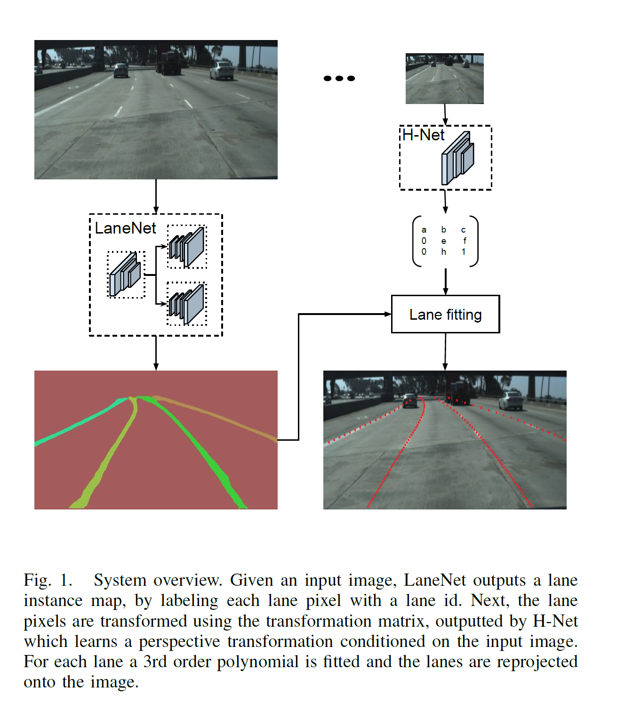
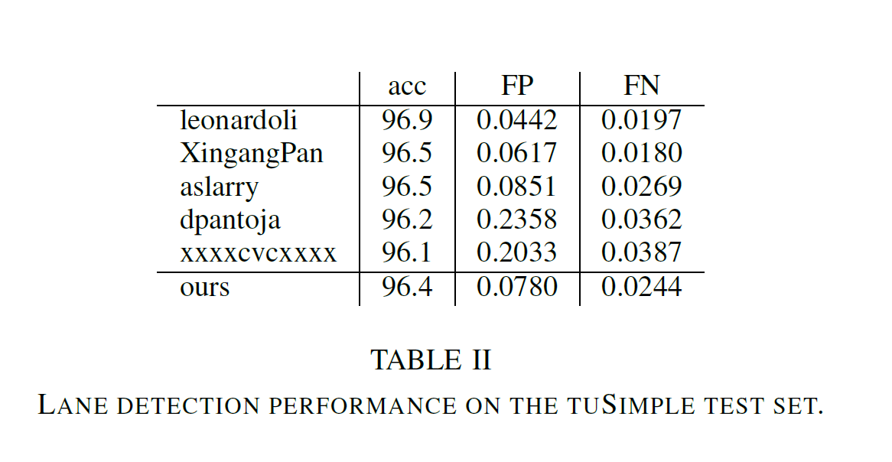
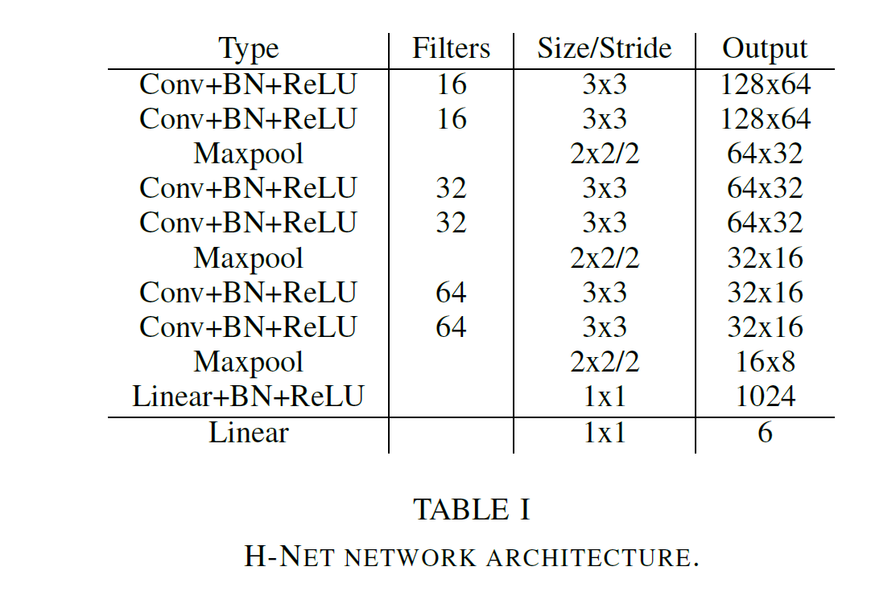
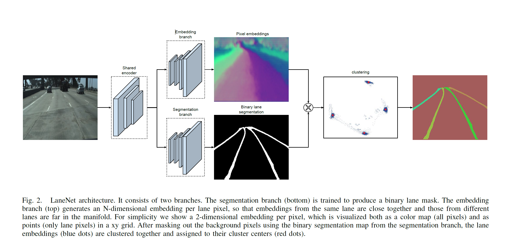

Towards End-to-End Lane Detection: an Instance Segmentation Approach
===

2018/02/15 Davy Neven, Bert De Brabandere, Stamatios Georgoulis, Marc Proesmans, Luc Van Gool

https://arxiv.org/abs/1802.05591
（まとめ：@yuji38kwmt）

---
## どんなもの？
* 50fpsで車線を検出するアルゴリズムを提案。
    * 変動的な車線数に対応
    * 車線変更に対応

---
## 先行研究と比べて何がすごい？

既存の手法の問題点が解決されている？

### 伝統的な車線検出法
* highly-specialized
* hand-crafted features
* heuristics to identify lane segments. 
* Popular choices of such hand-crafted cues include color-based features [7], the structure tensor [25], the bar filter [34], ridge features [26], etc., which are possibly combined with a hough transform [23, 37] and particle or Kalman filters [18, 8, 34]. 
* 一般的にロバスト性が低い

---
## どうやって有効だと検証した？
* tuSimple Challengで4位。

### Dataset(tuSimple)
* 3,626 training images
* 2,782 testing images
* 2-lane/3-lane/4-lane or more highway roads
* daytime
* under good and medium weather conditions

---
## 技術や手法の肝は？
* birds-eye-viewにすることで、車線が平行になる。2次、3次の多項式にあてはめられる？

* one-shot instancee segmentation（based on distance metric learnin）で、real-timeが実現できる？

### Lane-Fitting
* least square closed-form solutionなので、微分可能

### LaneNetのNetwork Architecture
* 意図的に小さくしている
* 3x3の畳み込み

---
## 議論はある？
なし

---

## 次に読むべき論文は？
* [A Dataset for Lane Instance Segmentation in Urban Environments](http://openaccess.thecvf.com/content_ECCV_2018/html/Brook_Roberts_A_Dataset_for_ECCV_2018_paper.html)

------
### 所感
* ソースがGitHubに上がっている。試してみよう。
https://github.com/MaybeShewill-CV/lanenet-lane-detection

### 用語
* tuSimple lane dataset
* RANSAC (Random Sample Consensus)：ロバスト推定
* LaneNet
* H-Net
* One-Shot
* Binary Segmentation
* closed-form（閉形式）：https://minus9d.hatenablog.com/entry/20130624/1372084229
* Automatic differentiation(自動微分)
* MSE: mean squared error
* bounded inverse class weighting?
* 

