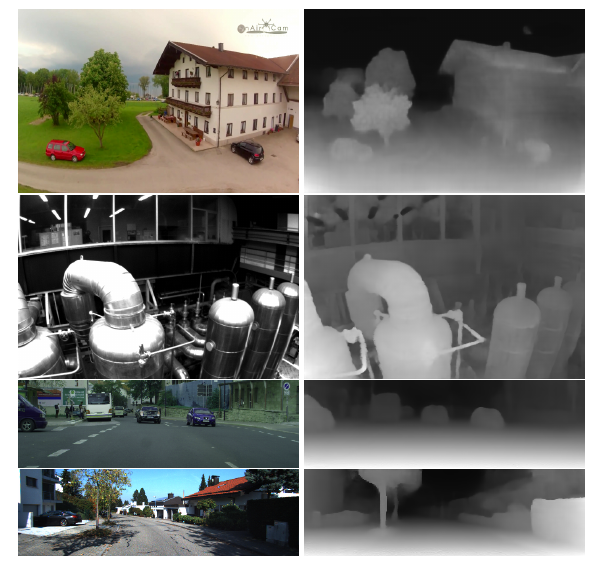

# Depth from Videos in the Wild: Unsupervised Monocular Depth Learning from Unknown Cameras 
[https://arxiv.org/abs/1904.04998](https://arxiv.org/abs/1904.04998)
(まとめ @n-kats)

著者
* Ariel Gordon
* Hanhan Li
* Rico Jonschkowski
* Anelia Angelova
Google AIもしくはRobotics at Googleの人たち

# どんなもの？
struct2depthの改良版

単眼カメラ、教師なしで距離（depth）の認識を訓練する手法。
カメラの回転・移動やカメラパラメータ（中心座標・焦点距離・歪み係数）も訓練で獲得。

# 先行研究と比べてどこがすごい？
struct2depthからの変更

|要素|struct2depth|本手法|
|---|---|---|
|カメラパラメータ|事前にキャリブレーションしたものを利用|訓練で獲得|
|移動物の抽出|mask rcnnなどのインスタンスセグメンテーションモデルの利用|bounding boxの検出モデルの利用|
|移動物の動作の表現|一体として回転・移動|各ピクセルでの移動ベクトル|
|フレーム間の隠れの対処|無し|損失関数で配慮|

# 技術や手法の肝は？
## struct2depth系
連続するフレームを与えて、距離やカメラのmotionをNNで算出。
* 認識したdepthとmotionが、3次元的な変換で前フレームから次フレームが構成できるように訓練
* 移動物があるとノイズになるため、特別なケアを行う。

## possibly mobile mask
物体検出モデルを使って、bounding boxで検出。その範囲をpossibly mobile maskとする。

フレーム間のmotionを、possibly mobile maskの範囲外は一つのmotionで制御。範囲内は、各ピクセル毎に移動ベクトルを認識して制御。

possibly mobile maskの範囲外を使ってキャリブレーションをする感じになっている。

## フレーム間の隠れの対処
各ピクセルのdepthやmotionをもとにフレーム間の対応を取る。このとき、隠れてしまって対応が取れない点がある。この部分で発生する損失をゼロにするケアを行う。

## ネットワーク構成
* depthを認識するネットワーク（UNet風）
* motionを認識するネットワーク（FlowNet風UNet）
  * 1x1のところでカメラのmotion、カメラパラメータを出力
  * UNet風のセグメンテーション風の出力で移動ベクトルを出す

## randomized layer normalization
BNはbatch sizeが小さいと微妙（mini batchが似た画像からなると偏っていて微妙）→ batch sizeを増やしても上手く行かなかった→ LNをしたがこれも微妙→LNで計算する平均・分散にノイズを入れると性能が上がった

# どうやって有効だと検証した？
* KITTI
* Cityscapes
* EuRoC Micro Aerial Vehcle Dataset
* YouTube8M videos（quadcopter）
に適用。上2つは評価値が他手法より良い。下2つは比較相手がいない。

# 議論はある？
* カメラパラメータの無い動画データでもできるから、色んなものが利用できるようになったかも

## 私見
* randomized layer normalizationが謎
* カメラが動かないと機能しなさそう
* 2フレームでカメラパラメータを出すのは少し無理があるのでは？動かないとか

# 次に読むべき論文は？
* [https://people.eecs.berkeley.edu/~tinghuiz/projects/SfMLearner/cvpr17_sfm_final.pdf](https://people.eecs.berkeley.edu/~tinghuiz/projects/SfMLearner/cvpr17_sfm_final.pdf)  
  先行研究（struct2depth）の先行研究。訓練の詳細が分かるかも
