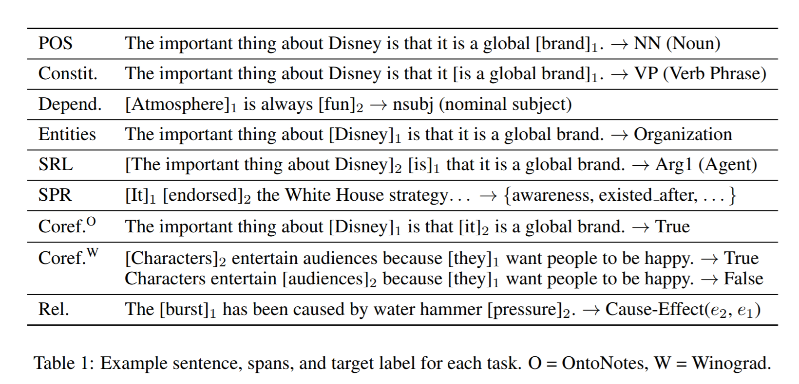
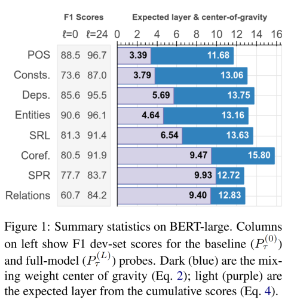
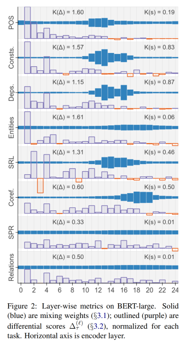
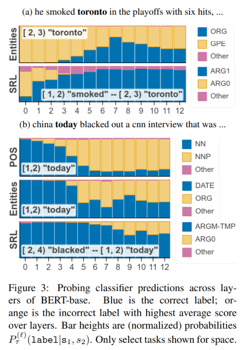

BERT Rediscovers the Classical NLP Pipeline
===

2019/05/15 Ian Tenney(Google Research), Dipanjan Das(Google Research), Ellie Pavlick(Brown University)
[https://arxiv.org/abs/1905.05950](https://arxiv.org/abs/1905.05950)

（まとめ：@nharu1san）

---

## どんなもの？
- BERTの分析
- NLPの伝統的な処理をBERTが各層でやっていることがわかった
- パイプラインは動的に調整され、初めの層で誤っていても上層で修正される

---

## 先行研究と比べて何がすごい？

---

## 技術や手法の肝は？
- Scalar Mixing Weights

  - ELMoと同様の重み調整を行う
  - Center-of-Gravity
    
    - 各タスクの平均参加層数を反映される
- Cumulative Scoring

  - 各層を導入することどれだけ高いスコアが得られるかわかる
  - Expected Layer
  
    - 差分スコアに対する疑似的な期待値

---

## どうやって有効だと検証した？
### proving task

- Part-of-speech tagging (POS)
  - 品詞のタグ付けを行う
- Constituent labeling (Consts.)
  - [i, j)間の句構造分類タスク
- Dependency labeling (Deps.)
  - フレーズ間の関係性の予測
- Named entity labeling(Entities)
  - 与えられたエンティティスパンのカテゴリ(person, location,  organizationなど)を予測する
- Semantic role labeling (SRL)
  - 述語項構造のラベリングを行う(ARG0, ARG1, ARGM-TMPなど)
- Coreference (Coref.)
  - 2つのトークンが同一のものを指すかどうか判定する
- Semantic proto-role (SPR)
  - 述語と引数間の関係の潜在的な属性についてマルチラベル分類をする
- Relation Classification (Relations)
  - 2つのエンティティ間に成立する現実世界の関係を予測する

### Results

基本的な構文情報はネットワークの初期の段階で表現され、上位レベルの意味情報は上位層に現れる

(a)では誤って"tronto"が都市を指しており、GPEとしてタグ付けしているが、"tronto"が"smoked"されたと判断した後は、ORGが増えている("tronto"は正しくは都市ではなくトロント・ブルージェイズを指す)

---

## 議論はある？
- RelationsとSPRではmixed weightは一様に近く、すべての層で徐々に解決されている
  - これがBERTがこのタスクの正しい抽象化を表現するのが難しいからなのか、もしくは意味情報が本質的にローカライズするのが難しいためか判断するにはさらなる研究が必要としている

---

## 次に読むべき論文は？
- [What do you learn from context? Probing for sentence structure in contextualized word representations](https://arxiv.org/abs/1905.06316)
  - 著者らの論文
  - probing taskが共通
  - ICLR 2019
