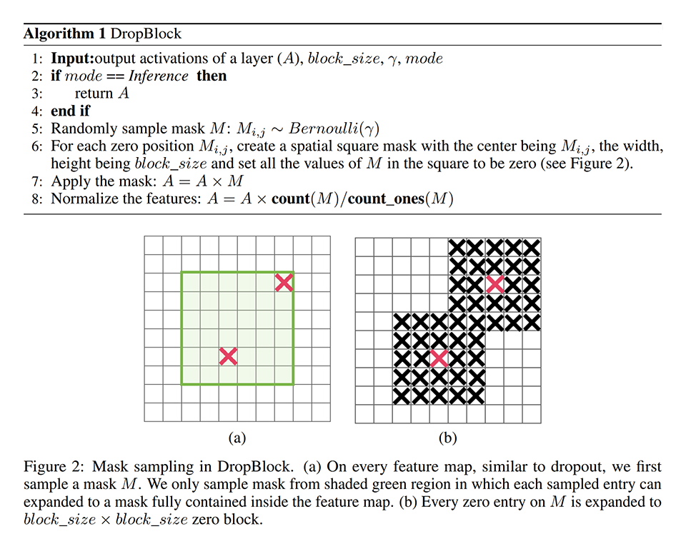
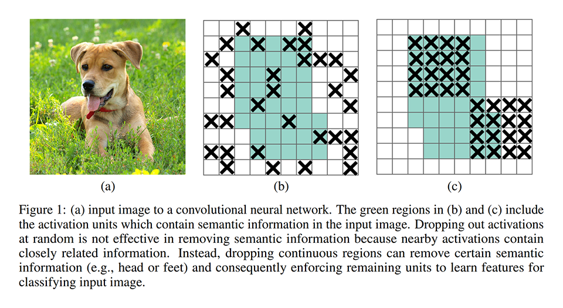
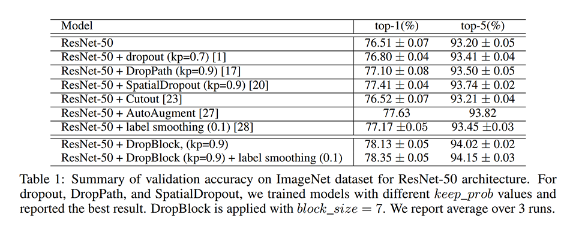
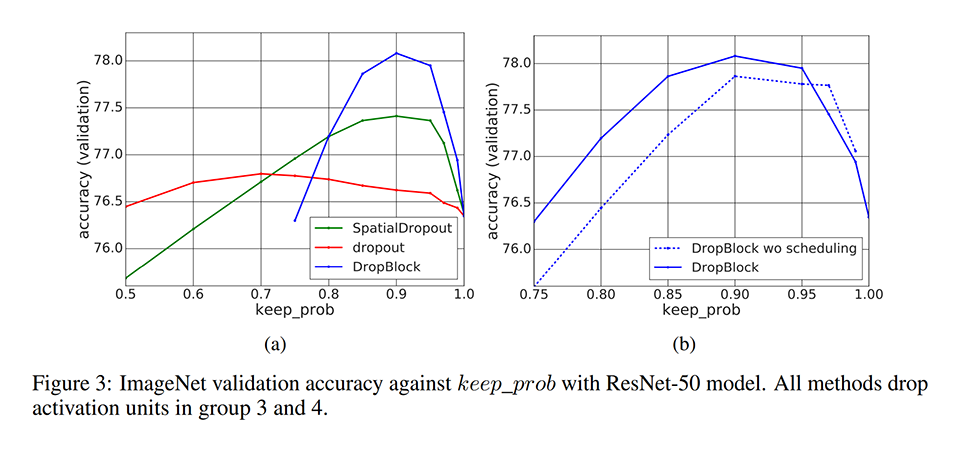
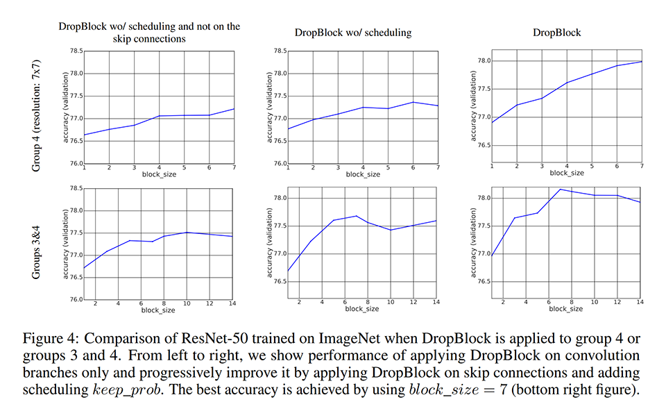
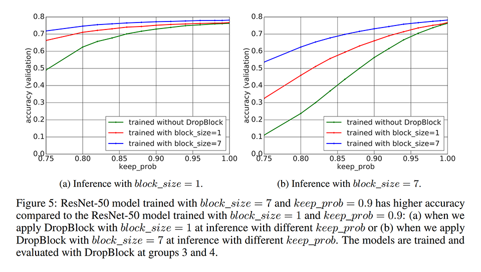

# DropBlock: A regularization method for convolutional networks [\[arxiv\]](https://arxiv.org/abs/1810.128901)

- 著者
    - Golnaz Ghiasi *1
    - Tsung-Yi Lin *1
    - Quoc V. Le *1
- 所属
    - 1: Google Brain

## どんなもの？
### DropBlock
- feature map の中からランダムに選ばれた複数の矩形領域内の特徴をマスクする（0 にする）正則化手法（DropOut の改良版）

## 先行研究と比べてどこがすごい？
### DropBlock
- 既存手法を大幅に上回る性能を達成

## 技術や手法の肝は？
- feature map（特徴に位置関係がある feature vector）は近傍の特徴の相関が高い。
- 特徴単位でマスクする DropOut では近傍の特徴からマスクしたはずの情報がリークしてしまうため、正則化の効果が薄れてしまう。
- 矩形領域に含まれる特徴を一括してマスクする DropBlock では、情報のリークを抑制できるため正則化の効果が薄れない。

## どうやって有効だと検証した？

### 分類タスクにおける性能比較
- モデル: ResNet-50（最後の 2 つの ResBlock に DropBlock や他の手法を適用）
- データセット: ImageNet

### 検出タスクにおける性能比較
- モデル: RetinaNet
- データセット: COCO

### 分割タスクにおける性能比較
- モデル: using ResNet-101 FPN
- データセット: PASCAL VOC 2012

### 注目領域の可視化

### ハイパーパラメータの違いによる性能の変化

## 議論はある？
- DropBlock を適用すると性能が上がることを示した。Skip Connection へも適用することで更に性能が上がることも示した。
- DropBlock を適用することで、より広い領域の特徴を見るようになっていることも確認できた。

## 次に読むべきタイトルは？
- [\[arxiv\]](https://arxiv.org/abs/1805.09501) Ekin D Cubuk, Barret Zoph, Dandelion Mane, Vijay Vasudevan, and Quoc V Le. "Autoaugment: Learning augmentation policies from data", arXiv preprint, 2018.
