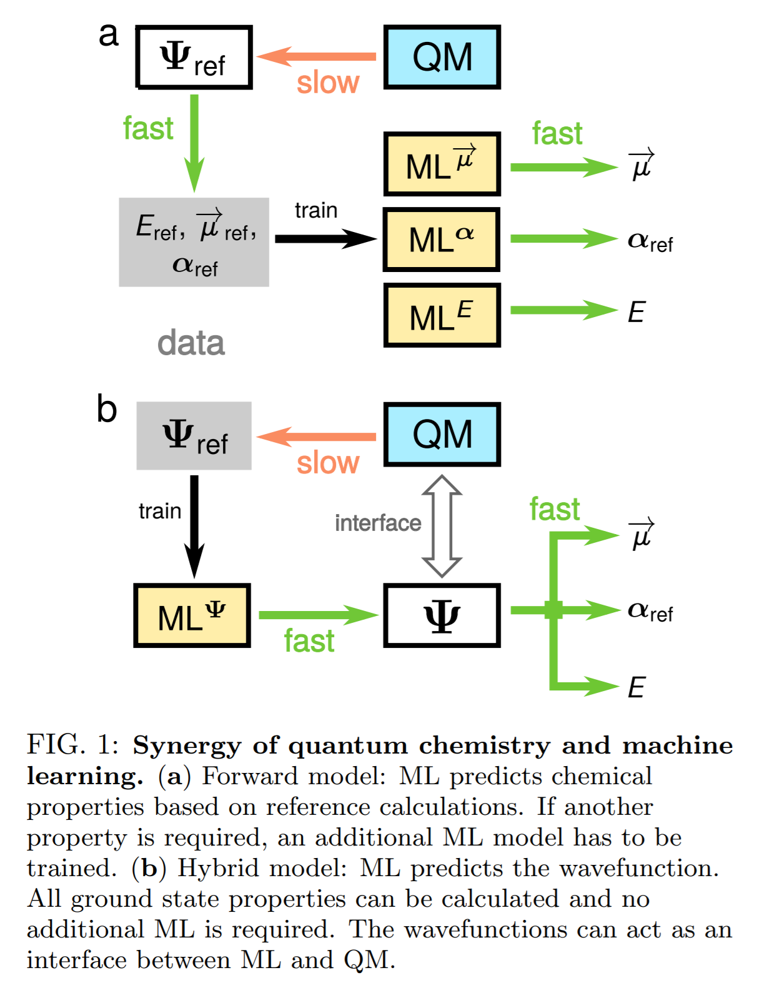

Unifying machine learning and quantum chemistry – a deep neural network for molecular wavefunctions
===

2019/06/24 K. T. Sch¨utt and M. Gastegger, A. Tkatchenko, K.-R. M¨uller, R. J. Maurer

https://arxiv.org/pdf/1906.10033.pdf

（まとめ：yuji38kwmt）

---

## どんなもの？

* 分子電子構造のMachine Learningモデルを計算するDeep Learning Frameworkを開発した
>In this work, we develop a deep learning framework 
that provides an accurate ML model of molecular electronic structure via a direct representation of the electronic Hamiltonian in a local basis representation. 

---
## どうやって有効だと検証した？
* エタノール(Ethanol)で確認
    * occupied orbitals(1-13番目)は高い精度（＜20meV）
    * virtual orbitals（13-20番目)の平均誤差は（～100meV）
    * virtual orbitalsの誤差が大きい理由：HF and Kohn-Sham DFT計算のデータから定義されていないから？
* occupied orbitalsの場合、’chemical accuracy’ (∼0.04 eV) を満たしている？

---
## 技術や手法の肝は？
* 特殊なニューラルネットワークを開発することなく、chemical properties算出できるようになった

>This makes it possible to
access a wide range of chemical properties without the
need for explicitly developing specialised neural network
architectures

---
## 議論はある？
"Discussion"はありましたが、分かりませんでした。。。

---
## 先行研究と比べて何がすごい？
たぶんSchNetと比較しているんですが、分かりませんでした。。。

---
## 次に読むべき論文は？
分からない。。。

----
## 用語
* Interatomic potential：原子間ポテンシャル
* eigenvalue：固有値
* malondialdehyde：マロンジアルデヒド
* SchNet: A continuous-filter convolutional neural network for modeling quantum interactions（cfconv layerを⽤いることで3次元空間上の任意の位置に存在する原⼦の相互作⽤を モデリングした）
* SchNOrb：波動関数を表現するために、SchNetを拡張したもの
* cosine similarities：コサイン類似度
* DFT：密度版関数理論（Density Functional Theory）
* HF：ハートリーフォック方程式（Hartree-Fock dquation）
* covariance：共分散
* dipole moment：双極子モーメント
* 
# 大事そうな文章

>All chemical concepts and
physical molecular properties are determined by the electronic Schr¨odinger equation and derive from the groundstate wavefunction.

* 原子座標や分子構成の関数は、固有値や波動関数の係数に対して滑らかでない
* State degeneracies(縮重度) and electronic level crossings（？）から、ML技術で固有値や波動関数を直接予測する？

>Unfortunately, as a function of atomic coordinates and changing molecular configurations, eigenvalues and wavefunction coefficients are not
well-behaved or smooth.State degeneracies and electronic level crossings provide a challenge to the direct prediction of eigenvalues and wavefunctions with ML techniques. We address this problem with a deep learning
architecture that directly describes the Hamiltonian matrix in local atomic orbital representation.

* 

---
### 参考資料
* [SchNet: A continuous-filter convolutional neural network for modeling quantum interactions](https://www.slideshare.net/KazukiFujikawa/schnet-a-continuousfilter-convolutional-neural-network-for-modeling-quantum-interactions)
* [HOMO/LUMO](https://omedstu.jimdo.com/2017/11/12/フロンティア軌道理論とhomo-lumo/)

### 英語
* analogously：類似して
* conjecture：推測
* depicts：描く
* tandem：縦に並ぶ

## 分からなかったこと
* Fig. S2：コサイン類似度をどう見ればよい？
