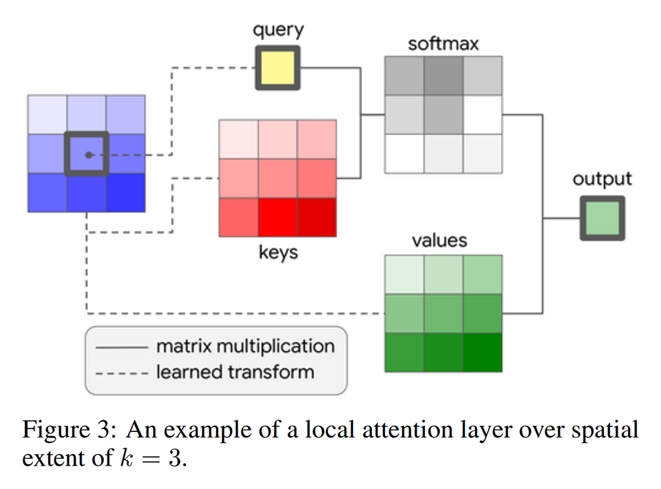
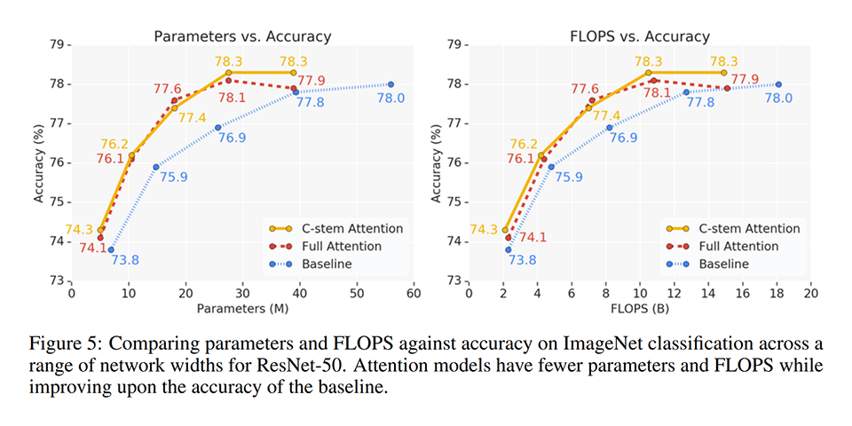
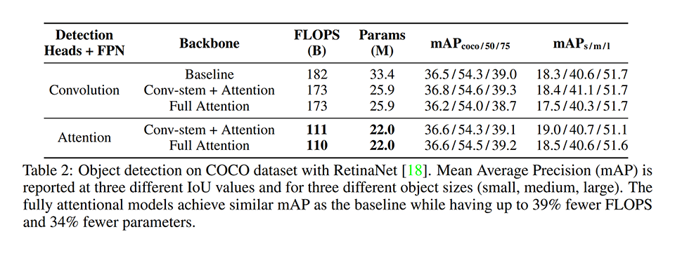
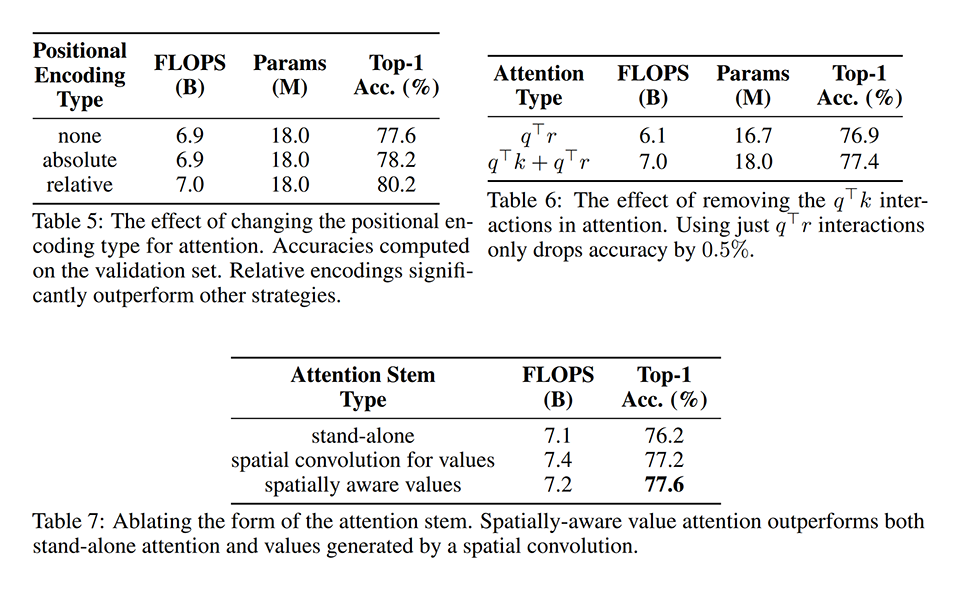

# [\[arxiv\]](https://arxiv.org/abs/1906.05909) Stand-Alone Self-Attention in Vision Models

- 著者
    - Prajit Ramachandran ∗1
    - Niki Parmar ∗1
    - Ashish Vaswani ∗1
    - Irwan Bello *1
    - Anselm Levskaya *1
    - Jonathon Shlens *1
- 所属
    - 1: Google Research, Brain Team

## どんなもの？
### Local Self-Attention Layer (stand-alone)
- 自己注意機構により生成したカーネルを用いた（入力の内容に応じてカーネルの内容が変化する）畳み込み層である。出力層に近いところで使うと効果的である。
- 特徴の値だけでなく相対位置に関する情報も用いた推論ができる。相対位置に関する情報を用いると更に性能が向上する。
- 通常の畳み込み層と比べてパラメータ数が少ない。
- 通常の畳み込み層と比べて計算量（FLOPS）が少ない（ただし現状の GPU 実装では遅い）。

### Local Self-Attention Layer (spatially aware values)

### 通常の畳み込み層（参考）

## 先行研究と比べてどこがすごい？
### Stand-Alone Local Self-Attention Layer
- 通常の畳み込みより少ないパラメータ数で同等以上の性能を達成した。

## 技術や手法の肝は？
- 素朴に畳み込みカーネルに自己注意機構を適用したものになっている（私見: ちゃんと局所特徴になっているため窓を設計できる点がよい）。

## どうやって有効だと検証した？

### 画像分類タスクにおける性能比較
- モデル: ResNet-50 に提案手法を適用したもの
- タスク: ImageNet classification

### 物体検出タスクにおける性能比較
- モデル: RetinaNet に提案手法を適用したもの
- タスク: COCO Object Detection

### 切除実験
- どの層に適用すべきか？
    - 出力に近い層に適用すると効果的である。
- どのくらいのカーネルサイズがよいか？
    - 小さなカーネルサイズ（3 など）では性能上の弊害が大きいので、大きなカーネルサイズ（11 付近）を使うべきである（適切なカーネルサイズはタスクごとに異なる）。
- 位置情報はどのくらい重要か？
    - 位置情報はあった方がよい。絶対位置よりも相対位置の方がよい。
    - コンテンツ⇔コンテンツのインタラクションに関する項を削除して、コンテンツ⇔相対位置のインタラクションに関する項だけにすると、性能が低下する。位置情報の埋め込み方は研究してゆく余地がある。
- どのような注意機構がよいか？
    - stand-alone < spatial convolution for values < spatially aware values (pointwise-transformation)
    - 将来的に、位置を考慮する注意機構とメイントランクの注意機構を統合することが考えられる。

## 議論はある？
- 通常の畳み込みより少ないパラメータ数で同等以上の性能を達成した。
- spatially aware values により入力に近い層で注意機構が効果的に機能するようにできる。
- ジオメトリを捉えるよりよい方法を開発することで性能が改善される可能性がある。
- 通常の畳み込み層と比べて計算量（FLOPS）が少ないが、現状の GPU 実装では、最適化されたカーネルが存在しないため遅い。注意機構が実行可能なパスを提供するとみなせば、大幅に処理時間を抑えることができる可能性がある。

## 次に読むべきタイトルは？
- [\[arxiv\]](https://arxiv.org/abs/1801.10130) T. S. Cohen, M. Geiger, J. Köhler, and M. Welling, "Spherical cnns", arXiv preprint, 2018.
- [\[arxiv\]](https://arxiv.org/abs/1902.04615) T. S. Cohen, M. Weiler, B. Kicanaoglu, and M. Welling, "Gauge equivariant convolutional networks and the icosahedral cnn", arXiv preprint, 2019.
