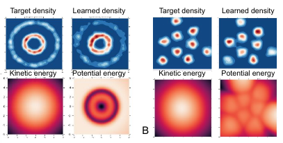

# Equivariant Hamiltonian Flows
[https://arxiv.org/abs/1909.13739](https://arxiv.org/abs/1909.13739)
(まとめ @n-kats)

著者
* Danilo Jimenez Rezende
* Sébastien Racanière
* Irina Higgins
* Peter Toth

4人ともdeepmind

# どんなもの？
Equivariant: 同変（対称性を考慮している理論の意）

ハミルトニアンを利用したFlow系の生成モデルへ対称性の背景知識を入れる方法を提案。

# 先行研究と比べてどこがすごい？
対称性をモデルに反映する話では、HoloGANがある。HoloGANではテンソルを直接回転させている。

この手法では、損失関数で対称性を表現できる。

# 技術や手法の肝は？
## ハミルトン力学
q: 位置, p: 慣性, H(q, p): ハミルトニアン（実数値関数）として、
dq/dt = ∂H/∂p, dp/dt = -∂H/∂q の関係式で力学を表現する（このベクトル場をハミルトンベクトル場という）。

ハミルトニアンはエネルギーを意味する。エネルギー保存則が成立。

## ハミルトニアンを使った生成モデル
### フロー系生成モデル
ランダムな初期値から少しずつ変形させて目的の形状を生成するモデル（ランダムな点群から意味のある形状にする手法など）。変形にハミルトニアンを使う。

位置はデータがあるとして、慣性は位置から情報が一切無い。位置から慣性の分布を出す部分はそういうネットワークを訓練で獲得する（ハミルトニアンも）。

変形のアルゴリズムは、Leap Frogを用いる。位置と慣性を交互に更新する手法で、保存則や逆変換の点で良い（ルンゲクッタと比べて）。

### ELBO
位置から推論した慣性の分布と、その慣性をもとに逆算した初期値の分布を比較する損失関数を使う。

## ハミルトニアンと対称性
### ネーターの定理
実数値関数 g(q,p) が{H, g}=0 （ポアソンブラケット）を満たすときsymmetry generator という。ネーターの定理は対称性があるとこの関数が存在することを主張。逆にgのハミルトンベクトル場に沿って移動してもハミルトニアンの値が変わらないという対称性と関連した性質をもつ。

初期値の分布が対称性を持つとき、同じ対象性を持つハミルトニアンに従って分布を変形させたとき、変形後の分布も同じ対象性を持つ。

symmetry generator を背景知識の対称性を表すものとして利用する。

## 全体の損失関数
ELBOとsymmetry generatorを使う。

ただし、係数のλは非負で、L を大きくする方向へ

# どうやって有効だと検証した？
平面上の点を生成するモデルで検証。

教師は H(q, p) = K(p) + U(q) の形のものを用いてサンプリングしたものを用いる（K: 運動エネルギー, U: 位置エネルギー）。
位置エネルギーが回転対称なもの（左）と、対称性の一切無いケース（右）を実施。

初期値は原点中心の正規分布。K,U,pの分布（qから正規分布の平均・分散を算出）はニューラルネット（学習で獲得）。
回転対称を意味するsymmetry generator に g(q, p) = q1p2-q2p1 を利用。

# 議論はある？
物理への応用が熱い。

## 私見
同日にdeepmindからハミルトニアンを使った論文が公開されていて、deepmindの数学・物理チームの規模がヤバイ
* [Hamiltonian Generative Networks](https://arxiv.org/abs/1909.13789)
* [Hamiltonian Graph Networks with ODE Integrators](https://arxiv.org/abs/1909.12790)

# 次に読むべき論文は？
* [Hamiltonian Neural Networks](https://arxiv.org/abs/1906.01563)  
  元ネタっぽい
* [Towards a Definition of Disentangled Representations](https://arxiv.org/abs/1812.02230)  
  これもdeepmind製。群論を中心的な道具として取り組んでいる。
* [Hamiltonian Generative Networks](https://arxiv.org/abs/1909.13789)
* [Hamiltonian Graph Networks with ODE Integrators](https://arxiv.org/abs/1909.12790)
