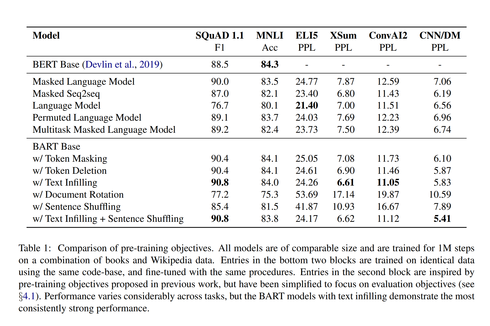

BART: Denoising Sequence-to-Sequence Pre-training for Natural Language Generation, Translation, and Comprehension
===

2019/10/29 Mike Lewis, Yinhan Liu, Naman Goyal, Marjan Ghazvininejad, Abdelrahman Mohamed, Omer Levy, Ves Stoyanov, Luke Zettlemoyer (Facebook AI)
[https://arxiv.org/abs/1910.13461](https://arxiv.org/abs/1910.13461)

（まとめ：@nharu1san）

---

## どんなもの？

- (ざっくり言うと)BERTをEncoder, GPTをDecoderとしたSeq2Seqモデル

---

## 先行研究と比べて何がすごい？
- 単純なTransformerのSeq2seq
- テキスト生成だけでなく文章理解タスクにも強い

---

## 技術や手法の肝は？
### モデル構造

### 事前学習タスク設定

- Token Masking
- Sentence Permutation
- Document Rotation
- Token Deletion
- Tet Infilling

---

## どうやって有効だと検証した？

- Discriminative Tasks
  - SQuAD 1.1, 2.0
  - GLUE
  - RoBERTaとほぼ同等の結果
- Generation Tasks
  - Summarization
    - CNN/DailyMail(https://cs.nyu.edu/~kcho/DMQA/)
      - 入力と密接に関連したニュース要約
    - XSum(https://github.com/EdinburghNLP/XSum)
      - 高度に抽象化されたニュース要約
    - UniLMやBERTSUMABSを上回った
  - Dialogue
    - ConvAI2(http://convai.io/)
      - ペルソナに基づいた対話データセット
  - Abstractive QA
    - ELI5(https://facebookresearch.github.io/ELI5/)
      - 回答にサポート文書を必要とする長文形式の抽象質問応答データセット
      - Fanらのモデル(https://arxiv.org/abs/1907.09190)を上回る
- Translation
  - WMT’16 RO-EN
    - ルーマニア語-英語の翻訳
    - ベースラインのTransformerを上回った

---

## 議論はある？
- 将来的にはタスクに合わせて事前学習タスクの調整を行う予定

---

## 次に読むべき論文は？
- [Mass: Masked sequence to sequence pretraining for language generation.](https://arxiv.org/abs/1905.02450)
  - 
