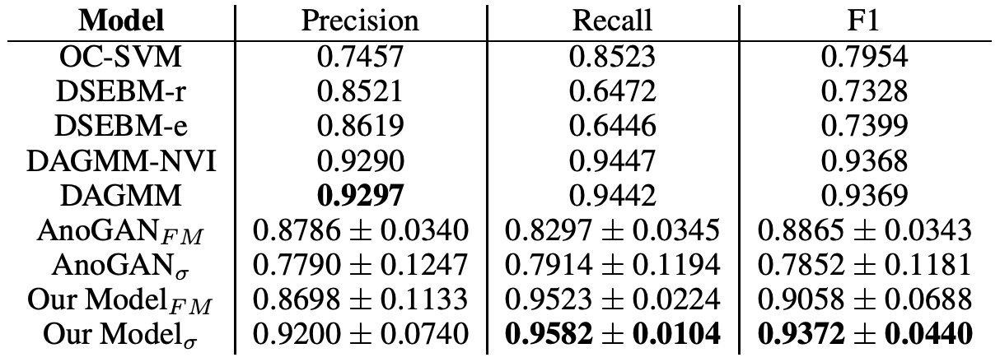

# EFFICIENT GAN-BASED ANOMALY DETECTION
 
### 論文著者
- Houssam Zenati @Institute for Infocomm Research, Singapore
- Chuan-Sheng Foo @Institute for Infocomm Research, Singapore
- Bruno Lecouat @Institute for Infocomm Research, Singapore
- Gaurav Manek @Carnegie Mellon University
- Vijay Ramaseshan Chandrasekhar @Nanyang Technological University(南洋理工大学@シンガポール)

論文
<https://arxiv.org/pdf/1802.06222.pdf>

コード
<https://github.com/houssamzenati/Efficient-GAN-Anomaly-Detection.git>

(まとめ: @wkluk-hk)

## どんなもの？
### 異常値検知の世界
- 応用事例：電波望遠鏡 100PB-10EB rangeデータから新天体を探す
- feature + distanceベースの異常検出... 次元の呪いでdistanceがどんどん無意味に
- supervied learningでやると、教師がない(異常値データが極端少ない）
- 近年は、unsupervised で作ったencoder/decoder + clustering の手法が増えてきた（気がする）

### 本論文のテーマ 

## 先行研究と比べてどこがすごい？
### Anomaly detection のいろいろアプローチ
- clustering approaches 
- nearest neighbor methods
- one class classification approaches (supervised)
- recent works use deep neural networks,which do not require explicit feature construction

### 本研究の特徴
- (Aside from AnoGAN) GANを使った anomaly detectionの研究はあまりなかった
	- AnoGANのまとめ: <https://github.com/mlnagoya/surveys/blob/master/20181213_reports/AnoGAN_devjap.md>
	- 遅いの問題らしい
- 当然、unsupervised/ 自動feature抽出 の アプローチの部類に入る

## 技術や手法の肝は？
### GAN訓練
- Discriminator, EncoderとGenerator ３者を一遍に学習させる
- Discriminatorは、データxと潜在変数z両方を見て真偽判断

学習は、

で  になるように学習

### 異常検知
データxの「異常さ」は、以下の A(x)として定義

- αはパラメータ
- L_Gは、「xと、人工データG(E(x))との直接比較」: 
- L_Dは、discriminator D(x,z)そのものの値のcross entropyを使うか、D(x,y)の-1 layerの中身(f_Dとよぶ）を使って計算するか、という２つの方法がある:
	- 方法１: 
	- 方法２: 

## どうやって有効だと検証した？
### 検証１
#### 方法
- MNISTの数字の中から、9個をnormalにして 1個をanomalyとする
- area under the precision-recall curve (AUPRC) をmetricsとする (≡ Average Precision ?)
- benchmarkとして、AnoGANとVAE(を使った、別のanomaly detection手法)を使用

#### 検証結果
- VAEと比べたら断然よい。AnoGANにも勝っている(7だけなぜか負ける...)
- AnoGANと比べたら推論が800x早い
- L_Dの選択肢として、D(x,y)そのものより、「D(x,y)の-1 layerの中身」を使ったほうがよい

### 検証2
#### 方法
- KDDCUP99を使う (ネットワーク侵入検知にまつわるデータ．正常通信と攻撃を分類するもの）
- metricsは、precision/recall/f値の３点セット(「20%が異常」と固定)

		
## 議論はある？
とくになし

## 次に読むべきタイトルは？
- Adversarially Learned Anomaly Detection
同じ著者の新作... <https://arxiv.org/pdf/1812.02288.pdf>
- A Flexible Framework for Anomaly Detection via
Dimensionality Reduction <https://arxiv.org/pdf/1909.04060.pdf>
	- encoder/decoder/clustering を組み合わせて anomaly detection手法を、frameworkとして実装した話
