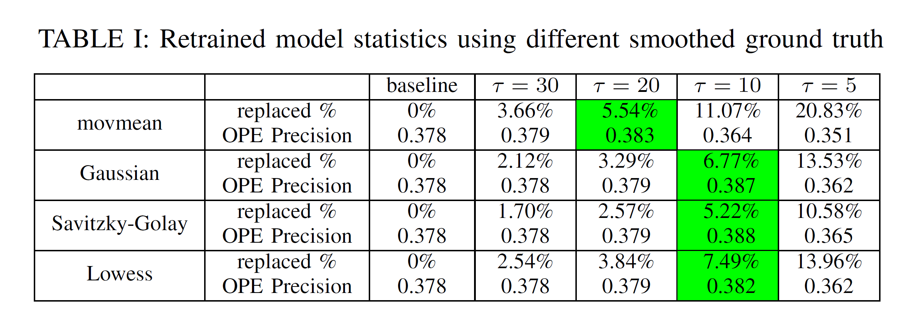
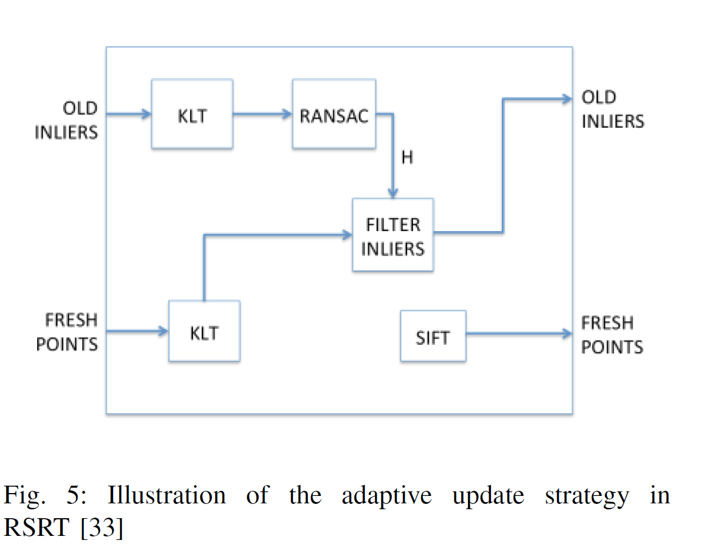
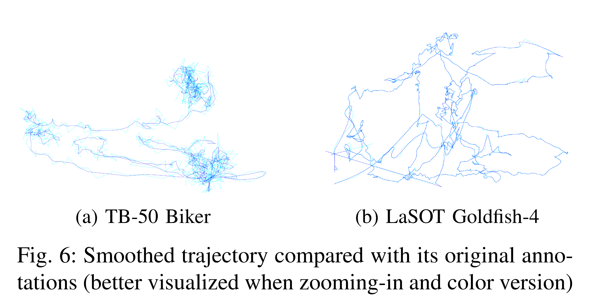
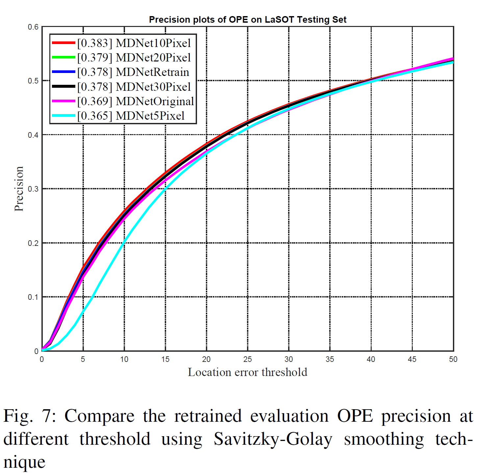

Improving Human Annotation in Single Object Tracking
===

2019/11/07 Yu Pang, Xinyi Li, Lin Yuan, Haibin Ling

https://arxiv.org/abs/1911.02807

（まとめ：yuji38kwmt）

---

## どんなもの？
* video tracking sequencesの人によるアノテーションを、改善する方法を提案した。
    * 平滑化アルゴリズムでアノテーションを平滑化して、平滑化した軌跡を元画像に投影した。
* 人によるアノテーションのガイドラインになる
* 間違った（outliers）アノテーションの修正に役立つ
    * データの品質とモデルが改善する

---

## どうやって有効だと検証した？
* 訓練データの一部を平滑化されたデータに置き換えて、OPE Precisionを比較した。
    * 5%程度置換したら、精度改善に意味があった。
    * 10%置換したら、baselineを下回った。

---
## 技術や手法の肝は？

* 画像の位置合わせ(Image Alignment)
    * RANSAC Tracking (RSRT)を使った方法。SIFT、HoG、ORB、SURFなどでポイント抽出
    * enhanced correlation coefficient maximization (ECC)

* 軌跡の平滑化（Trajectory Smoothing）メソッドで試したもの
    * Moving Average
    * Gaussian Smoothing
    * SavitzkyGolay smoothing
    * Local regression
* Smoothed Data as Better Ground Truth
    * 青線が平滑化されたアノテーションの軌道、シアン（水色？）線は元のアノテーションの軌道
    

---
## 議論はある？
* オブジェクトが隠れている場合役に立つ（人はオブジェクトの重心を決めるののい時間がかかるため）
* 画像の位置合わせ技術に依存しているため、位置合わせに失敗すると、うまくいかない

---
## 先行研究と比べて何がすごい？
なし

---

## 次に読むべき論文は？
* [LaSOT: A High-quality Benchmark for Large-scale Single Object Tracking](https://arxiv.org/abs/1809.07845)

---------------------------------
---------------------------------
### トラッキングアノテーションの失敗要因
* Partially or fully occlusion
* Close to boundary or out of view
* Object deformation

### 参考
* LaSOT Dataset
https://cis.temple.edu/lasot/download.html

### 分からなかったこと
* Fig.6の軌道はどのようにプロットした？
* Robust Image Alignment?
* canonical views?
* OPE precision？
* RANSAC
