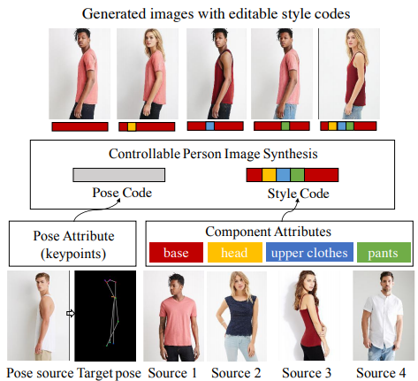
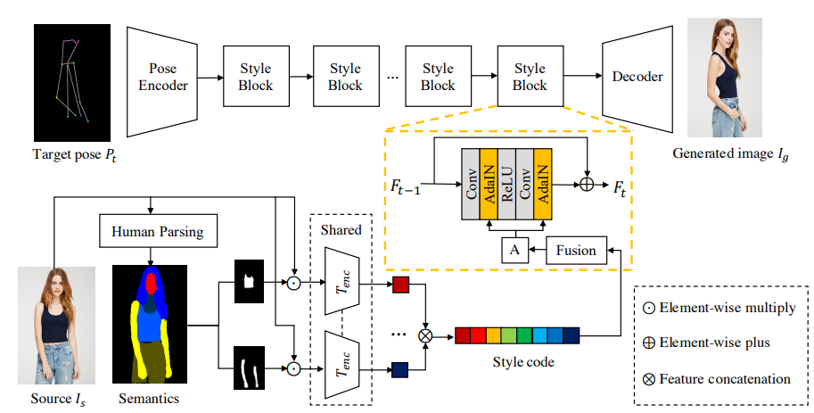
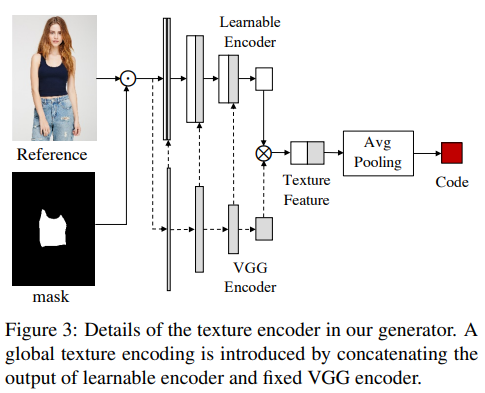
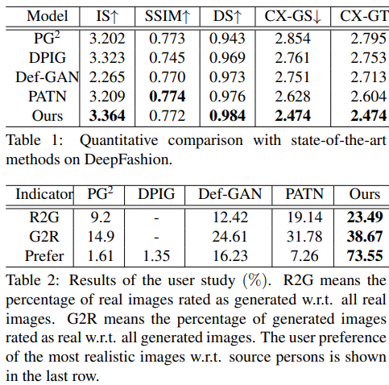
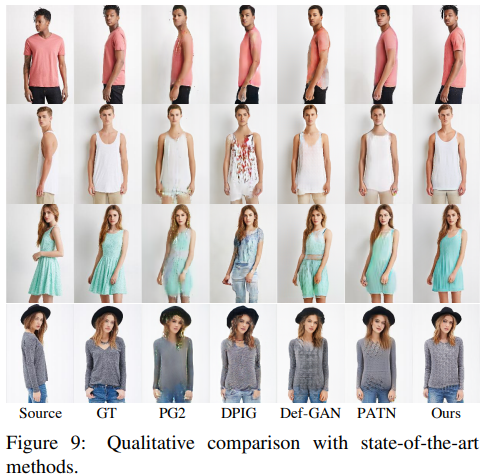
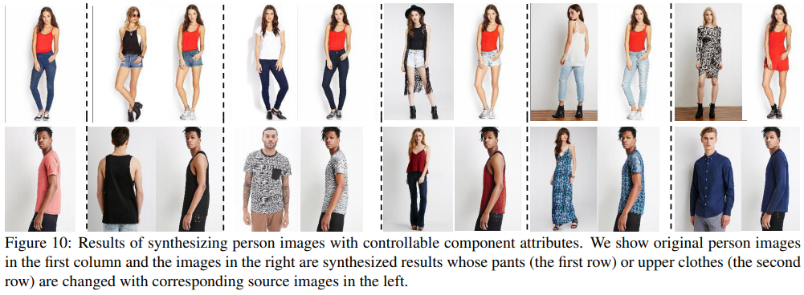

Controllable Person Image Synthesis with Attribute-Decomposed GAN
===

論文URL: [https://menyifang.github.io/projects/ADGAN/ADGAN_files/Paper_ADGAN_CVPR2020.pdf](https://menyifang.github.io/projects/ADGAN/ADGAN_files/Paper_ADGAN_CVPR2020.pdf)

補助資料URL: [https://menyifang.github.io/projects/ADGAN/ADGAN_files/Supp_ADGAN_CVPR2020.pdf](https://menyifang.github.io/projects/ADGAN/ADGAN_files/Supp_ADGAN_CVPR2020.pdf)

ビデオURL: [https://menyifang.github.io/projects/ADGAN/ADGAN_files/Video_ADGAN_CVPR2020.mp4](https://menyifang.github.io/projects/ADGAN/ADGAN_files/Video_ADGAN_CVPR2020.mp4)

著者
- Wangxuan Institute of Computer Technology, Peking University, China
  - Yifang Men
  - Zhouhui Lian1
- Bytedance AI Lab
  - Yiming Mao
  - Yuning Jiang
  - Wei-Ying Ma

# どんなもの？
- 人の姿勢と各部の属性を自在にコントロールして人の画像を生成するGAN

# 先行研究と比べて何がすごい？
## 先行研究のイケてなかったところ
- 人の姿勢を操作するネットワークはあったが、頭やシャツなどの属性を個別に、自在に操作できなかった
- 画像中に写る人に対し、服を着せ替える手法はあったが、複雑な見た目や形状に対応できていなかった
- 画像の属性操作をするときは、属性に対するラベルが必要だった (表情の操作の場合は 笑っている、髭が生えている、メガネを掛けている 等)

## 本研究のイケてるところ
- 姿勢、服装、頭などの各属性を、複数の画像から抽出して、ソース画像に適用することができる
- 各属性に対するラベルなしで学習できる (必要なのは人の画像のみ)
- 訓練の際は、画像中に映る人について、全方位から撮影した画像が含まれている必要はない

# 技術や手法の肝は？
## Generator

- 既存モデルを利用し、ソース画像からの姿勢情報、属性情報を抽出する
- 抽出した姿勢情報、属性情報から、それぞれ潜在変数C_{pose}とC_{sty}を生成する
    - PoseEncoder: ソース画像から姿勢情報C_{pose}をエンコード
        - 畳み込みCNN (論文中の設定では2層)
    - Tenc: ソース画像からテクスチャ情報C_{sty}をエンコード
        - 画像全体から潜在変数を抽出するのではなく、部品ごとに分けて作成することで、収束が早くなる
        - Tencの片方は重みを固定したVGG(COCOで事前学習済み), もう片方は学習可能なCNN
        
- StyleBlockを使用してそれらの潜在変数から画像を生成する

## Discriminator
- D_p と D_t の2つのDiscriminatorを利用する
  - D_p: 姿勢用のDiscriminator. ターゲット姿勢と生成画像 (または ターゲット画像) のペアを入力とし、生成画像かターゲット画像かを判別
  - D_t: テクスチャ用のDiscriminator. ソース画像と生成画像 (またはターゲット画像) のペアを入力とし、生成画像かターゲット画像かを判別

## 損失関数
- Adversarial Loss
  生成画像と、ターゲット画像の分布の距離に対して損失を与える
  
  
  
- Reconstruction Loss
  生成画像とターゲット画像とのL1距離 色の歪みを抑え、生成画像のクオリティを高める
  
  
  
- Perceptual Loss
  生成画像をVGGネットワークに通して得られた特徴マップと、ターゲット画像をVGGネットワークに通して得られた特徴マップ間の距離 生成画像とターゲット画像のテクスチャの差異に対しての損失
  
  
  
- Contextual Loss
  被写体の位置が揃っていない、2つの画像間の類似度を測る損失
  
  

# どうやって有効だと検証した？

## 定量評価
- 生成モデルの評価によく使われているIncepsion ScoreとSSIMを使った評価
- 生成画像から人が検出できるかどうかを測るDetection Scoreを使った評価
- 生成画像と、ソース画像(ターゲット画像)間の一貫性を測るCX-GS(CX-GT)という評価指標を提唱
  - 上に上げた3つの評価指標は、モデルによって生成された画像しか評価しない
  - 特徴抽出機によって抽出されたそれぞれの画像の特徴マップ間のコサイン類似度により評価

## 定性評価
- 従来手法により生成した画像を、人手により評価
   - 本物の画像50枚、生成画像50枚 計100枚の画像セットを、各手法について作成(合計500枚)し、それぞれの画像について、本物か生成画像かを選択してもらう
   - 1枚のソース画像を、5つの手法を使って属性変換し、どれが一番自然な画像か選んでもらう

## 議論はある？
疑問
- データセットはランダムに分割されたとの記述があったが、訓練データ内に存在しない人に関してはどれくらい上手く生成できるのか？

## 次に読むべき論文は？
- 特になし